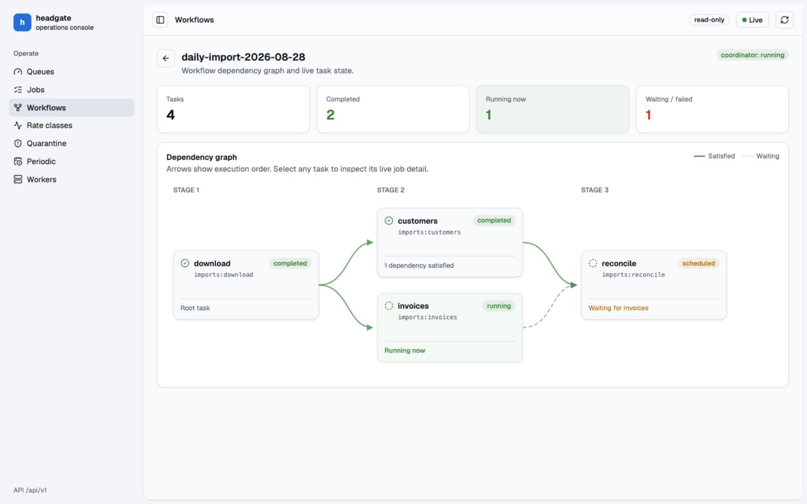

# Headgate

[](https://github.com/Mujhtech/headgate/actions/workflows/ci.yml)
[](https://crates.io/crates/headgate)
[](https://pkg.go.dev/github.com/mujhtech/headgate/go)
[](LICENSE)

Headgate runs reliable background jobs in Go and Rust using PostgreSQL, MySQL, or Redis.

Define a typed job, enqueue it from your application, and let Headgate handle retries,
scheduling, workflows, progress, results, and worker coordination. Its rate limits, tenant
fairness, concurrency ceilings, and quarantine rules apply across the whole worker
fleet—not independently in each process.

[Documentation](https://headgate.mintlify.app/) ·
[Quickstart](https://headgate.mintlify.app/docs/quickstart) ·
[Examples](https://headgate.mintlify.app/docs/examples/overview) ·
[Latest release](https://github.com/Mujhtech/headgate/releases/latest)

## Why Headgate

- **Fleet-wide policy:** rate limits and concurrency budgets are shared by every worker.
- **Fair multi-tenant execution:** busy tenants cannot starve quieter tenants while spare
  capacity remains usable.
- **Typed jobs in Go and Rust:** register strongly typed handlers and reject unknown job
  kinds at startup.
- **Reliable execution:** leases, fencing, retries, timeouts, deadlines, panic recovery,
  graceful shutdown, and separate crash accounting are built in.
- **Scheduling and orchestration:** delayed and periodic jobs, resumable steps, progress,
  results, and durable workflow DAGs.
- **Production controls:** queue management, quarantine and redrive, worker control,
  OpenTelemetry, a control API, CLI, and an embedded web UI.
- **Security by default:** payloads are redacted from inspection unless requested and can
  be encrypted at rest with client-managed keys.

## Try it locally

The basic examples use the in-memory test store, so no database or external service is
required:

```bash
git clone https://github.com/Mujhtech/headgate.git
cd headgate

# Rust
cargo run --manifest-path examples/rust/Cargo.toml --bin basic

# Go
cd examples/go
GOWORK=off go run ./basic
```

Both examples define a typed `Welcome` job, register its handler, enqueue it, run the real
admission and dispatch path, and verify that it completed.

## Define a job

### Rust

```rust
use headgate::{JobCtx, Registry, Task};
use serde::{Deserialize, Serialize};

#[derive(Debug, Deserialize, Serialize, Task)]
#[task(kind = "email:welcome", version = 1)]
struct WelcomeEmail {
    address: String,
}

let mut registry = Registry::new();
registry.register::<WelcomeEmail, _, _>(|_: JobCtx, job| async move {
    send_welcome_email(&job.address).await?;
    Ok(())
})?;
```

Install the runtime and one backend:

```toml
[dependencies]
headgate = "0.1.7"
headgate-postgres = "0.1.7" # or headgate-mysql / headgate-redis
```

See the [Rust SDK guide](https://headgate.mintlify.app/docs/sdk/rust/overview) for client,
worker, and enqueue setup.

### Go

Requires Go 1.25 or newer.

```go
type WelcomeEmail struct {
	Address string `json:"address"`
}

func (WelcomeEmail) Kind() string { return "email:welcome" }

registry := headgate.NewRegistry()
err := headgate.RegisterFunc[WelcomeEmail](registry,
	func(ctx context.Context, job *headgate.Job[WelcomeEmail]) error {
		return sendWelcomeEmail(ctx, job.Args.Address)
	},
)
```

Install the runtime and one backend:

```bash
go get github.com/mujhtech/headgate/go
go get github.com/mujhtech/headgate/go/driver/headgatepgx
# or driver/headgatemysql / driver/headgateredis
```

See the [Go SDK guide](https://headgate.mintlify.app/docs/sdk/go/overview) for runner,
client, and enqueue setup.

## Choose a backend

| Backend | Use it when |
| --- | --- |
| PostgreSQL | You want the reference backend, transactional enqueueing, and notifications. |
| MySQL | Your application already runs on MySQL and polling fits your deployment. |
| Redis | You want a low-latency Redis-native fleet and do not need SQL transactions. |

Backend packages are separate, so applications only pull in the driver they use. Start
with the [installation guide](https://headgate.mintlify.app/docs/installation) and apply
the matching migrations before starting workers.

## Operations console

Headgate includes a responsive console for jobs, queues, workflows, rate classes,
quarantine, periodic jobs, and workers. It is embedded directly into Go and Rust binaries;
you do not need to deploy a separate JavaScript server.



Try the complete read-only demo locally:

```bash
cd examples/go
GOWORK=off go run ./ui_demo
```

Then open `http://127.0.0.1:8080`. For production mounting and security guidance, see the
[operations console documentation](https://headgate.mintlify.app/docs/operations/console).

## More features

- Priorities, weighted queues, unique jobs, bulk enqueueing, and transactional enqueueing
- Scheduled, periodic, retryable, snoozed, rate-limited, and non-consuming outcomes
- Workflow fan-out/fan-in, named resumable steps, cursor iteration, and batch handlers
- Job progress, results, attempt history, mid-run output, subscriptions, and test helpers
- Producer middleware, authorization, insert hooks, backpressure, and circuit breaking
- PostgreSQL, MySQL, and Redis implementations with matching core behavior

See the [feature index](https://headgate.mintlify.app/docs/reference/feature-index) for the
full list and the documented boundaries of each backend.

## Agent skill

The [Headgate skill](skills/headgate/SKILL.md) helps coding agents integrate producers,
workers, workflows, and operational tooling in Go and Rust applications.
Install it with the [Skills CLI](https://skills.sh/docs/cli):

```bash
npx skills add Mujhtech/headgate
```

## License

Licensed under the [Apache License, Version 2.0](LICENSE).
