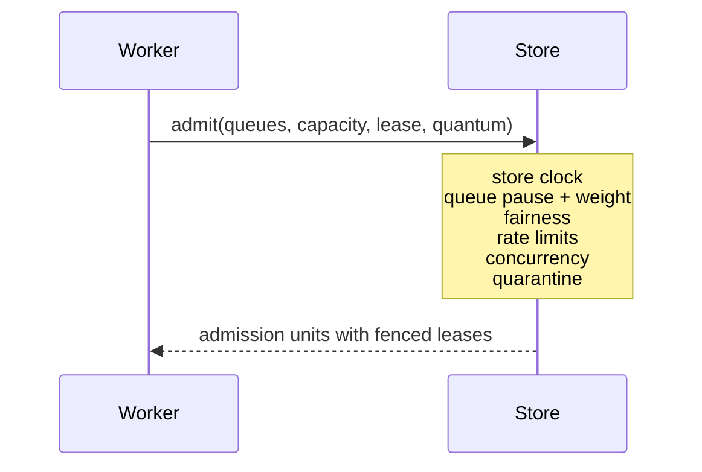

Admission is the defining operation in headgate. A worker provides its queue set and free
capacity. The store evaluates every configured policy using store-owned time, then writes
the claim and lease in the same atomic operation.

## Non-negotiable properties

- Policy-rejected jobs remain visible and unlocked.
- The lease is written by the same statement or Lua script that claims the job.
- Store time controls refill, scheduling, and lease expiry.
- Candidate selection draws per partition so one flooding tenant cannot hide quiet ones.
- Fairness is work-conserving: spare capacity never idles to punish a noisy tenant.
- Rate-limited work is requeued without consuming an attempt.

<Note>
PostgreSQL uses one admission query, MySQL uses its matching atomic transaction path, and
Redis uses one Lua script. Their behavior is compared by cross-language conformance.
</Note>

## Admission units

Claims are returned in groups called admission units. Units normally contain one job today,
but the shape reserves correct accounting for future store-side aggregation without
reopening the hardest boundary in the system.
