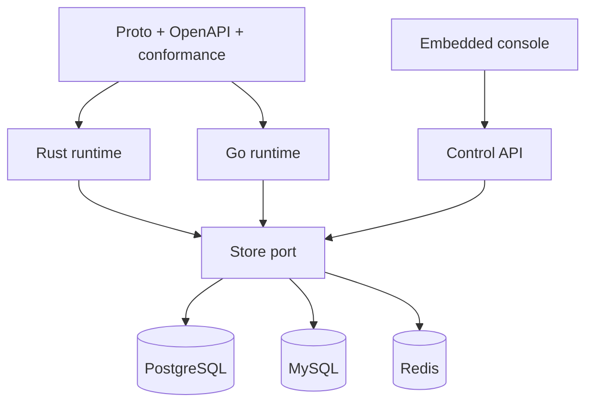

Headgate has a small driver-free core surrounded by replaceable adapters and consumers.

## Responsibility boundaries

| Layer | Owns | Must not own |
| --- | --- | --- |
| Core | Envelopes, outcomes, leases, state transitions, ports | Drivers, exporters, HTTP |
| Store adapter | Atomic admission, persistence, store clock, optional capabilities | Handler dispatch |
| Runtime | Typed dispatch, heartbeats, shutdown, panic isolation, steps | Fleet policy evaluation |
| Producer | Validation, authorization, middleware, hooks | Admission decisions |
| Control API | Bounded inspection and idempotent mutations | Queue-depth scans |
| Console | Operator experience | Direct database access |

<Info>
Optional capabilities are explicit. A backend that cannot provide transactions,
inspection, or notifications declines that capability instead of exposing a no-op method.
</Info>

## Shared truth

Rust and Go generate or derive from the same protocol, OpenAPI document, state machine,
and conformance scenarios. Neither implementation is used as the specification for the
other.

<CardGroup cols={2}>
  <Card title="Admission" icon="shield-check" href="/docs/concepts/admission" />
  <Card title="Project map" icon="folders" href="/docs/reference/project-map" />
</CardGroup>
