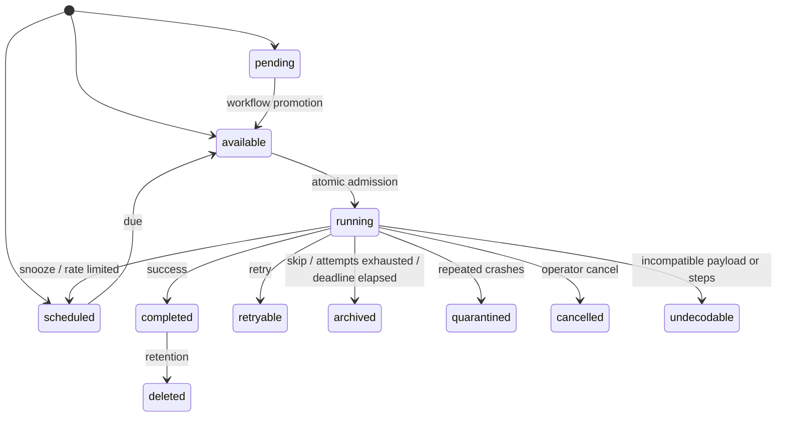

A job is a durable envelope plus store-owned execution state. The envelope carries typed
payload bytes, routing fields, policy inputs, version information, and retention rules.

## Important envelope fields

| Field | Purpose |
| --- | --- |
| `id` | Stable logical identity and idempotency boundary |
| `kind` | Typed handler lookup key |
| `schema_version` | Payload decoding and upcasting |
| `fingerprint` | Content identity, uniqueness, and crash quarantine |
| `queue` | Queue selection; queue weight never overrides job priority |
| `partition_key` | Tenant fairness group |
| `rate_class` | Shared token budget |
| `priority` | Ordering within a partition |
| `scheduled_at_ms` | Earliest eligible time, in store-clock milliseconds |
| `retention_ms` | Terminal record lifetime |

## Lifecycle

`attempt` counts returned failures. `crash_attempt` counts expired leases and process
crashes. The distinction is durable because quarantine depends on it.

The `archived` state is Headgate's dead-letter queue: retry-exhausted, skipped, and
deadline-expired jobs remain inspectable and can be redriven while their terminal retention
is active. It is distinct from `quarantined` poison-pill fingerprints, `undecodable`
payloads, and the optional SQL cold archive used only for long-term audit.

<Card title="Dead-letter queue" icon="archive" href="/docs/guides/dead-letter-queue">
  Inspect, diagnose, redrive, and retain archived jobs safely.
</Card>

<Warning>
Job payloads are excluded from inspection by default. Operators must explicitly request
`include_payload`; control-plane mounts commonly live under `/admin` and payloads may
contain personal data.
</Warning>
