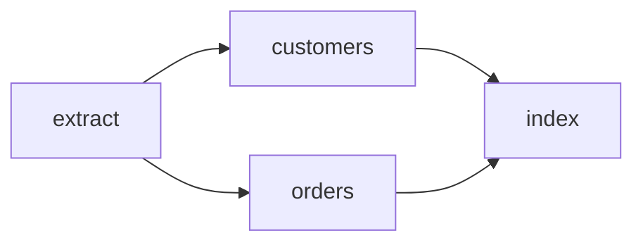

The workflow examples build this graph and verify that `prepare` returns one coordinator
followed by four pending child jobs.



<CodeGroup>

```bash Rust
cargo run --manifest-path examples/rust/Cargo.toml --bin workflow
```

```bash Go
cd examples/go
GOWORK=off go run ./workflow
```

</CodeGroup>

Expected shape:

```text
daily-import-2026-08-28:coordinator  pending=false
daily-import-2026-08-28:extract      pending=true
daily-import-2026-08-28:customers    pending=true
daily-import-2026-08-28:orders       pending=true
daily-import-2026-08-28:index        pending=true
```

## Rust

```rust
use std::io;

use headgate::{Envelope, Task};
use headgate_workflow::{CoordinatorTask, Workflow};
use serde::{Deserialize, Serialize};

#[derive(Debug, Deserialize, Serialize, Task)]
#[task(kind = "example:daily-import", version = 1)]
struct ImportTask {
    stage: String,
}

fn envelope(stage: &str) -> Result<Envelope, Box<dyn std::error::Error>> {
    let task = ImportTask { stage: stage.into() };
    Ok(Envelope {
        kind: ImportTask::TYPE.into(),
        payload: task.encode()?,
        queue: "imports".into(),
        schema_version: ImportTask::VERSION,
        ..Default::default()
    })
}

fn main() -> Result<(), Box<dyn std::error::Error>> {
    let batch = Workflow::new("daily-import-2026-08-28")
        .coordinator_queue("workflows")
        .add("extract", envelope("extract")?, Vec::<String>::new())
        .add("customers", envelope("customers")?, ["extract"])
        .add("orders", envelope("orders")?, ["extract"])
        .add("index", envelope("index")?, ["customers", "orders"])
        .prepare()?;

    if batch.len() != 5 || batch[0].kind != CoordinatorTask::TYPE {
        return Err(io::Error::other("unexpected workflow batch").into());
    }
    for (index, job) in batch.iter().enumerate() {
        if index > 0 && !job.pending {
            return Err(io::Error::other("child was not prepared as pending").into());
        }
        println!("{} pending={}", job.id, job.pending);
    }
    Ok(())
}
```

## Go

```go
package main

import (
    "encoding/json"
    "fmt"

    headgate "github.com/mujhtech/headgate/go"
    "github.com/mujhtech/headgate/go/headgateworkflow"
)

type importTask struct {
    Stage string `json:"stage"`
}

func (importTask) Kind() string { return "example:daily-import" }

func envelope(stage string) (headgate.Envelope, error) {
    payload, err := json.Marshal(importTask{Stage: stage})
    if err != nil {
        return headgate.Envelope{}, err
    }
    return headgate.Envelope{
        Kind:          importTask{}.Kind(),
        Payload:       payload,
        Queue:         "imports",
        SchemaVersion: 1,
    }, nil
}

func run() error {
    extract, err := envelope("extract")
    if err != nil { return err }
    customers, err := envelope("customers")
    if err != nil { return err }
    orders, err := envelope("orders")
    if err != nil { return err }
    index, err := envelope("index")
    if err != nil { return err }

    batch, err := headgateworkflow.New("daily-import-2026-08-28").
        CoordinatorQueue("workflows").
        Add("extract", extract).
        Add("customers", customers, "extract").
        Add("orders", orders, "extract").
        Add("index", index, "customers", "orders").
        Prepare()
    if err != nil {
        return err
    }
    if len(batch) != 5 || batch[0].Kind != headgateworkflow.CoordinatorKind {
        return fmt.Errorf("unexpected workflow batch: %#v", batch)
    }
    for i, job := range batch {
        if i > 0 && !job.Pending {
            return fmt.Errorf("child %s was not prepared as pending", job.ID)
        }
        fmt.Printf("%s pending=%t\n", job.ID, job.Pending)
    }
    return nil
}

func main() {
    if err := run(); err != nil {
        panic(err)
    }
}
```

<Note>
The no-service example validates graph construction. Database-backed coordinator tests
also prove dependency release and completion against the real store transaction path.
</Note>
