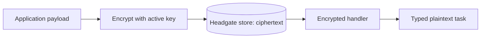

Headgate provides opt-in, client-side payload encryption through `headgate-crypto` for
Rust and `go/headgatecrypto` for Go. Encryption happens before enqueue, and decryption happens
inside the registered handler. Core and the storage drivers never receive encryption keys.



## Install

<CodeGroup>

```toml Rust
[dependencies]
headgate = "0.1.10"
headgate-crypto = "0.1.10"
```

```bash Go
go get github.com/mujhtech/headgate/go
go get github.com/mujhtech/headgate/go/headgatecrypto
```

</CodeGroup>

## Encrypt before enqueue

The key provider exposes one active write key and any historical read keys. The built-in
static keyring is useful for configuration-backed keys; production applications can
implement the provider interface over a KMS or secret manager.

<CodeGroup>

```rust Rust
use std::{collections::BTreeMap, sync::Arc};
use headgate_crypto::{StaticKeyring, encrypt_envelope, register_encrypted};

let keys = Arc::new(StaticKeyring::new(
    "2026-08",
    BTreeMap::from([("2026-08".into(), [7u8; 32])]),
)?);

let encrypted = encrypt_envelope(keys.as_ref(), envelope)?;
client.enqueue(&[encrypted]).await?;

register_encrypted::<SecretReport, _, _>(
    &mut registry,
    keys,
    |_ctx, task| async move {
        deliver(task).await
    },
)?;
```

```go Go
keys, err := headgatecrypto.NewStaticKeyring("2026-08", map[string][32]byte{
    "2026-08": {7},
})
if err != nil { return err }

envelope, err = headgatecrypto.EncryptEnvelope(keys, envelope)
if err != nil { return err }
if err := client.Enqueue(ctx, []headgate.Envelope{envelope}); err != nil {
    return err
}

err = headgatecrypto.RegisterEncrypted[SecretReport](registry, keys,
    func(ctx context.Context, job *headgate.Job[SecretReport]) error {
        return deliver(ctx, job.Args)
    })
```

</CodeGroup>

<Warning>
Register encrypted task kinds with the encrypted registration function. A normal typed
handler receives ciphertext and correctly classifies it as undecodable.
</Warning>

## What is protected

AES-256-GCM encrypts only `Envelope.payload`, using a fresh 96-bit nonce for every
encryption. The authenticated data binds the ciphertext to the job ID, task kind, and
schema version. Moving ciphertext to another job or changing its decoder identity fails
authentication and moves the job to `undecodable` instead of retrying forever.

The following values remain visible because admission and operations need them:

- job ID, kind, schema version, queue, partition, rate class, tags, and headers;
- priority, schedule, retry, lease, and retention metadata;
- results, progress, mid-run output, logs, and attempt errors.

Use database or disk encryption when the entire store must be opaque. Do not place secrets
in visible metadata or output fields unless the application protects them separately.

## Fingerprints and equality

Headgate computes the fingerprint from plaintext before adding the random nonce. That
preserves uniqueness and poison-pill quarantine across identical encrypted payloads. It
also reveals that two payloads are equal even though their ciphertext differs.

## Rotate keys without losing jobs

1. Add the new key while retaining all old keys.
2. Change the provider's active key ID so new jobs use the new key.
3. Keep historical keys until no queued, scheduled, retryable, quarantined, or retained
   job can reference them.
4. Remove an old key only after that retention window has closed.

Headgate stores the key ID in a versioned wire format but never stores key material. Rust
and Go share the same byte-level format, so either runtime can process a job encrypted by
the other when both have the same key.

## Inspect encrypted jobs in the console

The job detail view recognizes the encrypted envelope and labels it as AES-256-GCM. It
shows the wire-format version, key ID, and copyable Base64 ciphertext. By default it does
not offer decryption. An embedding application may opt into read-only reveal by installing
a `PayloadRevealer` in the Rust or Go control API configuration.

That callback is the authorization and decryption boundary. It receives the established
request identity/context and a complete job containing ciphertext, and returns plaintext
bytes—not keys. A typical implementation checks an application role, reconstructs the
minimal envelope identity (`id`, `kind`, `schema_version`, and `payload`), and calls
`decrypt_envelope` / `DecryptEnvelope` with its server-side key provider. Map a missing or
invalid historical key to the public “cannot be revealed” error; do not return KMS or key
details to the browser.

Once configured, `/meta` advertises `payload_reveal` and the encrypted-payload panel shows
an explicit **Reveal plaintext** button. `GET /jobs/{id}/payload/reveal` is read-only and
works when the console itself is in read-only mode. It fetches and decrypts for that
response only: it never edits, re-encrypts, retries, or changes the stored job. Responses
carry `Cache-Control: no-store`, and the console keeps plaintext outside its shared query
cache and clears it on hide, close, navigation, or an aborted request. Neither API logs
the plaintext; application callbacks must preserve that rule in their own telemetry.

<Warning>
Installing a revealer does not add authentication. Mount the API behind authentication,
attach trusted identity in middleware, and make the callback deny anonymous or
unauthorized callers. Headgate never trusts an identity header.
</Warning>

Routing metadata, tags, progress, results, output, and errors remain visible because this
layer encrypts only the payload bytes.

<Card title="Run the encryption example" icon="play" href="/docs/examples/encryption">
  Verify ciphertext, authenticated decoding, and the shared application boundary locally.
</Card>
