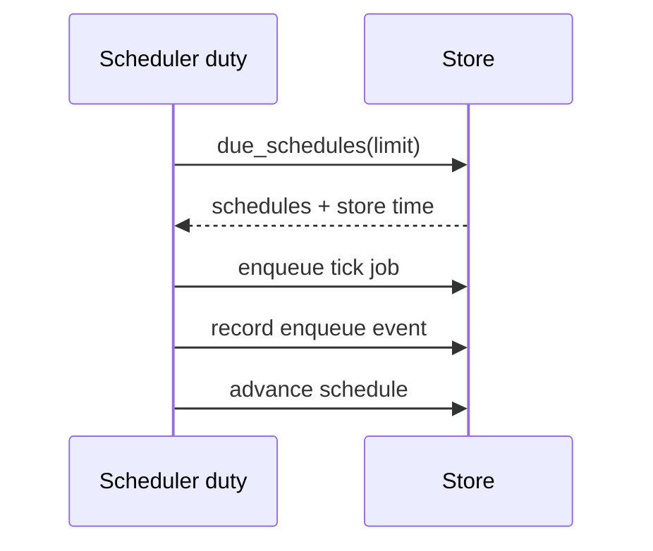

Periodic schedules are durable store records, not process-local timers. One scheduler duty
holder reads bounded due schedules, enqueues deterministic tick identities, records the
attempt, and advances the next run.



## Operational guarantees

- The scheduler duty uses the store's lease mechanism.
- Tick identity prevents a repeated duty attempt from duplicating the same logical run.
- Missed-run behavior is explicit per schedule.
- Enqueue hooks receive schedule and tick context.
- The API and console expose bounded enqueue history.

## Schedule specifications

The control API accepts epoch-aligned intervals and cron expressions:

```text
@every:30000
0 9 * * *
CRON_TZ=America/New_York 0 9 * * *
```

Five-field cron expressions have minute precision; six fields add seconds. A nonexistent
local time during a daylight-saving transition is skipped, while a repeated local time
fires once at its first occurrence. `@every` is always aligned to UTC and rejects a
`CRON_TZ` prefix.

## Periodic origin

Every scheduler-created job stores `periodic_schedule_id` and `periodic_tick_ms`. Job
inspection exposes the pair as `periodic_origin`; ordinary jobs return `null`. Validation
and database constraints require both fields together.

The typed origin is intentionally separate from job IDs, uniqueness keys, and opaque
headers. Operators never need to parse an implementation-specific generated ID to find
the schedule and tick that created a job.

## Enqueue-event audit trail

Every automatic tick produces a durable operator-facing enqueue-attempt record:

```http
GET /api/v1/periodic/{schedule_id}/enqueue-events?limit=30
```

The limit is between 1 and 100. Responses contain `events` and an opaque `next_cursor`.
Stores retain the newest 100 records per schedule, newest first, so both writing and
inspection remain bounded. Deleting a schedule does not delete its enqueue history.

| Outcome | Meaning |
| --- | --- |
| `enqueued` | The exact tick job is durable, including an idempotent same-ID replay after a crash. |
| `deduplicated` | A unique-key winner or changed-content ID collision already owns the tick identity. |
| `failed` | Enqueue was unavailable or rejected; the schedule stays due for retry. |
| `skipped` | Policy deliberately prevented enqueue, currently because of quarantine. |

Records contain schedule and tick identity, job ID, store timestamp, outcome, and a stable
low-cardinality reason. They never store payloads or raw backend error text.

The scheduler records the event after enqueue and before compare-and-set schedule advance.
If writing the audit record fails, it does not advance the schedule. A later sweep replays
the deterministic job ID; uniqueness prevents a second job while allowing the missing
audit record to be filled.
