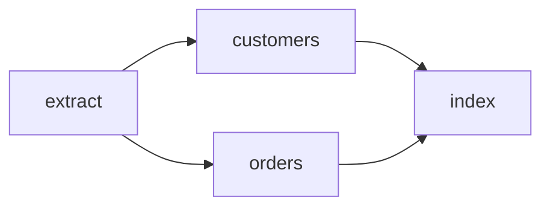

Workflows are an opt-in layer over ordinary jobs. The graph is validated before enqueue,
then prepared as one atomic batch containing a coordinator and pending children.

Graphs are deliberately bounded: 999 task nodes, 10,000 dependency edges, and 128 bytes
per task name. Coordinator ticks read and mutate nodes with a fixed concurrency of 16, so
a large valid graph cannot create an unbounded task or connection fan-out. Forged
coordinator payloads are revalidated by the worker before any graph operation runs.



## Prepare the graph

<CodeGroup>

```rust Rust
let batch = headgate_workflow::Workflow::new("daily-import")
    .coordinator_queue("workflows")
    .add("extract", extract, Vec::<String>::new())
    .add("customers", customers, ["extract"])
    .add("orders", orders, ["extract"])
    .add("index", index, ["customers", "orders"])
    .prepare()?;

store.enqueue(&batch).await?;
```

```go Go
batch, err := headgateworkflow.New("daily-import").
    CoordinatorQueue("workflows").
    Add("extract", extract).
    Add("customers", customers, "extract").
    Add("orders", orders, "extract").
    Add("index", index, "customers", "orders").
    Prepare()
if err == nil { err = store.Enqueue(ctx, batch) }
```

</CodeGroup>

## Run the coordinator

Register the coordinator on workers serving its queue, alongside every application task
handler. It uses bounded point reads through the inspection capability.

<CodeGroup>

```rust Rust
headgate_workflow::register_coordinator(
    &mut registry,
    store.clone(),
    Duration::from_secs(1),
)?;
```

```go Go
err := headgateworkflow.RegisterCoordinator(registry, store, time.Second)
```

</CodeGroup>

Roots are promoted first. A child becomes available only after every dependency completes.
If an upstream job reaches a failed terminal state, descendants that never ran are deleted
and the coordinator archives.

## Retention during long workflows

The builder raises every child retention value to at least the workflow retention. On each
tick, the coordinator copies newly observed completions into its fenced checkpoint before
it promotes dependent work. This makes completion evidence durable even when an early job
row expires while a later task is still running or retrying.

If operators must retain every child's full job detail, choose a workflow retention that
covers the expected maximum workflow runtime plus the desired inspection window. Dependency
correctness no longer depends on keeping every completed row for that entire time. A missing
node without recorded completion evidence remains a workflow failure.

## Long-running tasks and lease loss

The runner renews leases while a handler is executing. A suspended laptop, stopped
container, network partition, or overloaded process cannot renew, so the store eventually
reclaims the expired lease and counts a crash. That is expected recovery behavior: the old
attempt is fenced and a later attempt owns the job.

Make long stages resumable instead of relying on one uninterrupted process lifetime. Use a
named cursor step, persist the cursor after each safely repeatable unit, and stop promptly
when the handler context is cancelled.

<CodeGroup>

```rust Rust
let cursor_ctx = ctx.clone();
ctx.step_cursor("import-pages", move |cursor| {
    let ctx = cursor_ctx.clone();
    async move {
        let mut page = decode_page(cursor)?;
        while page < total_pages {
            import_page(page).await?;
            page += 1;
            ctx.set_cursor(serde_json::to_vec(&page)?).await?;
        }
        Ok(())
    }
}).await?;
```

```go Go
err := headgate.StepCursor(ctx, "import-pages", func(ctx context.Context, cursor PageCursor) error {
    for page := cursor.Page + 1; page <= totalPages; page++ {
        if err := importPage(ctx, page); err != nil { return err }
        if err := headgate.SetCursor(ctx, PageCursor{Page: page}); err != nil { return err }
    }
    return nil
})
```

</CodeGroup>

Cursor persistence is fence-verified. If the lease has already been reclaimed, the write
fails and the stale attempt must stop; the new attempt resumes from the last cursor that
the store accepted.

## Inspect graph state

Graph reads are available directly from both workflow libraries; they do not depend on
the console. A snapshot includes the accepted base graph plus additive grafts, current
node and coordinator states, revision, retry generation, dependency edges, reverse
dependent edges, and virtual-node configuration. Application payloads are excluded.

<CodeGroup>
```rust Rust
let graph = headgate_workflow::inspect_workflow(store.as_ref(), "daily-import").await?;
let index = graph.node("index").ok_or("index node missing")?;
let prerequisites = graph.dependencies("index").unwrap();

let downstream = headgate_workflow::workflow_dependents(
    store.as_ref(),
    "daily-import",
    "extract",
).await?;
let page = headgate_workflow::list_workflows(store.as_ref(), None, 50).await?;
```

```go Go
graph, err := headgateworkflow.InspectWorkflow(ctx, store, "daily-import")
if err != nil { return err }
index := graph.Node("index")
prerequisites, ok := graph.Dependencies("index")

downstream, err := headgateworkflow.WorkflowDependents(ctx, store, "daily-import", "extract")
page, err := headgateworkflow.ListWorkflows(ctx, store, "", 50)
```
</CodeGroup>

Use `workflow_node` / `GetWorkflowNode`, `workflow_dependencies` /
`WorkflowDependencies`, and `workflow_dependents` / `WorkflowDependents` for convenient
single-relation reads. When several questions are needed, fetch one snapshot and use its
in-memory methods so the graph is internally consistent and the store is read only once.

The same reads are available over HTTP. `GET /api/v1/workflows` returns a bounded,
cursor-paginated coordinator list; `GET /api/v1/workflows/{id}` and the
`/nodes/{node}`, `/dependencies`, and `/dependents` subresources. A retained completion
remains `completed` after its job row expires; an unrecorded absent row is explicitly
reported as `missing`.

## Durable signals, payloads, and source history

A signal is declared as a workflow node and stored as a retained pending internal job, so
delivery survives worker restarts on PostgreSQL, Redis, and MySQL. Emitting before
`prepare` completes is safe: Headgate records the emission first and releases the signal
job second. The coordinator consumes the completed signal only after its dependencies are
complete.

Use the rich emission API when the event carries business data. `payload` is the fact the
workflow is waiting for; `source` describes who or what emitted it. Both are arbitrary JSON
values. The `Idempotency-Key` (or SDK `idempotency_key`) identifies one emission: replaying
the same key and content returns the original record, while reusing the key with different
content is rejected.

<CodeGroup>
```rust Rust
use headgate_workflow::{Workflow, SignalEmission, emit_signal_with, list_signals};

let batch = Workflow::new("onboarding:42")
    .add("prepare", prepare_job, Vec::<String>::new())
    .add_signal("approval", "approved", ["prepare"])
    .add("welcome", welcome_job, ["approval"])
    .prepare()?;
store.enqueue(&batch).await?;

// Safe before or after `prepare` completes.
let receipt = emit_signal_with(
    store.as_ref(),
    "onboarding:42",
    SignalEmission {
        signal: "approved".into(),
        idempotency_key: "approval:ticket-1842".into(),
        payload: serde_json::json!({"approved": true, "reviewer": "Ada"}),
        source: serde_json::json!({"emitter": "admin-api", "actor": "operator-42"}),
    },
).await?;
assert_eq!(receipt.matched, 1);
assert!(receipt.inserted);

let history = list_signals(store.as_ref(), "onboarding:42", None, 100).await?;
assert_eq!(history[0].payload["reviewer"], "Ada");
```

```go Go
workflow := headgateworkflow.New("onboarding:42")
workflow.Add("prepare", prepareJob)
workflow.AddSignal("approval", "approved", "prepare")
workflow.Add("welcome", welcomeJob, "approval")

batch, err := workflow.Prepare()
if err != nil {
    return err
}
if err := store.Enqueue(ctx, batch); err != nil {
    return err
}

// Safe before or after prepare completes.
receipt, err := headgateworkflow.EmitSignalWith(ctx, store, "onboarding:42", headgateworkflow.SignalEmission{
    Signal:         "approved",
    IdempotencyKey: "approval:ticket-1842",
    Payload:        json.RawMessage(`{"approved":true,"reviewer":"Ada"}`),
    Source:         json.RawMessage(`{"emitter":"admin-api","actor":"operator-42"}`),
})
if err != nil {
    return err
}
history, err := headgateworkflow.ListSignals(ctx, store, "onboarding:42", 0, 100)
```
</CodeGroup>

The control API exposes the same contract:

```bash
curl -X POST "$HEADGATE_URL/api/v1/workflows/onboarding%3A42/signals" \
  -H 'Content-Type: application/json' \
  -H 'Idempotency-Key: approval:ticket-1842' \
  -d '{
    "signal": "approved",
    "payload": {"approved": true, "reviewer": "Ada"},
    "source": {"emitter": "admin-api", "actor": "operator-42"}
  }'

curl "$HEADGATE_URL/api/v1/workflows/onboarding%3A42/signals?limit=100"
```

Signal history is newest-first and retains the latest 100 emissions per workflow. That is
also the idempotency horizon: once an old record is trimmed, its key may be accepted again.
Payload is limited to 64 KiB and source metadata to 16 KiB. The store assigns the timestamp;
worker clocks are not trusted. `source` is caller-supplied metadata, not proof of identity—
authenticate the control API upstream and populate it from that trusted identity rather
than accepting arbitrary end-user values. The console shows matching signal history when
you inspect a signal node or a task directly waiting on one.

The short `emit_signal` / `EmitSignal` helpers remain for name-only events. They store a
`null` payload and empty source object, and use one legacy key per signal name; use the rich
API whenever multiple emissions or audit context matter.

Absolute timers use the backend's store clock and scheduled-job promoter:

<CodeGroup>
```rust Rust
let batch = Workflow::new("release:42")
    .add("prepare", prepare_job, Vec::<String>::new())
    .add_timer_at("release-window", release_at_ms, ["prepare"])
    .add("publish", publish_job, ["release-window"])
    .prepare()?;

let delayed = Workflow::new("follow-up:42")
    .add("prepare", prepare_job, Vec::<String>::new())
    .add_timer_after("cooldown", Duration::from_secs(30 * 60), ["prepare"])?
    .add("notify", notify_job, ["cooldown"])
    .prepare()?;
```

```go Go
workflow := headgateworkflow.New("release:42")
workflow.Add("prepare", prepareJob)
workflow.AddTimerAt("release-window", releaseAtMs, "prepare")
workflow.Add("publish", publishJob, "release-window")

delayed := headgateworkflow.New("follow-up:42")
delayed.Add("prepare", prepareJob)
if err := delayed.AddTimerAfter("cooldown", 30*time.Minute, "prepare"); err != nil {
    return err
}
delayed.Add("notify", notifyJob, "cooldown")
```
</CodeGroup>

Absolute deadlines are Unix milliseconds. A relative timer is anchored to the latest
dependency's store-stamped `finalized_at_ms`. The coordinator durably records that evidence
before atomically changing the timer from `pending` to `scheduled` at `anchor + delay`, so
worker clock skew and coordinator polling latency do not move the deadline.

### CEL waits

Use a condition node for a bounded boolean decision over workflow state. Available
variables are `revision` and `generation` (unsigned integers), `states` (node name to
state), and `completed` (node name to boolean).

<CodeGroup>
```rust Rust
let workflow = Workflow::new("approval:42")
    .add("prepare", prepare_job, Vec::<String>::new())
    .add_condition(
        "eligible",
        "completed.prepare && states.prepare == 'completed'",
        ["prepare"],
    );
```

```go Go
workflow := headgateworkflow.New("approval:42")
workflow.Add("prepare", prepareJob)
workflow.AddCondition("eligible", `completed.prepare && states.prepare == "completed"`, "prepare")
```
</CodeGroup>

Expressions are limited to 1,024 bytes, compile during `prepare`, cannot perform I/O, and
must return a boolean.

### Experimental graph grafts

Add ordinary tasks to a workflow that is still running by preparing a batch against the
current graph revision. Enqueue the returned receipt and tasks together in one atomic
store call.

<CodeGroup>
```rust Rust
let graft = WorkflowGraft::new("onboarding:42", 1)
    .queue("workflows")
    .add("send-survey", survey_job, ["send-welcome"])
    .prepare()?;

store.enqueue(&graft).await?;
```

```go Go
graft := headgateworkflow.NewGraft("onboarding:42", 1).Queue("workflows")
graft.Add("send-survey", surveyJob, "send-welcome")
batch, err := graft.Prepare()
if err != nil { return err }

if err := store.Enqueue(ctx, batch); err != nil { return err }
```
</CodeGroup>

Revision `1` is the initial graph, so this batch requests revision `2`. The receipt id is
deterministic (`onboarding:42:graft:2`): concurrent writers using the same expected
revision collide at atomic enqueue instead of both changing the graph. The coordinator
validates the combined DAG, checkpoints the new revision and nodes, and only then releases
the receipt handler. A crash in between replays the same accepted receipt.

Grafts are additive and currently accept ordinary tasks only. They cannot replace or
delete an existing node or revive a completed coordinator. Accepted grafts enter the
bounded workflow history. `POST /api/v1/workflows/{id}/grafts` provides the authenticated,
idempotency-key-protected control route. The console remains read-only while its mutation
controls are reviewed.

#### Non-task nodes cannot be grafted

Signals, absolute or relative timers, CEL conditions, and child-workflow links must be
declared when the initial workflow is prepared. Neither `WorkflowGraft::add` /
`WorkflowGraft.Add` nor `POST /api/v1/workflows/{id}/grafts` accepts those node types.
Attempting to represent one as an ordinary task does not give it signal, timer,
condition, or child-workflow semantics.

This boundary is deliberate. An ordinary task graft only adds a pending job and dependency
edges. Each non-task node needs additional durable rules:

- a signal needs a stable buffered-delivery identity and idempotent emission lookup;
- a relative timer needs a store-stamped dependency-completion anchor;
- a condition must be compiled, bounded, and evaluated against a defined workflow state;
- a child link changes the cross-workflow graph and therefore needs cycle detection,
  creation atomicity, cancellation propagation, and retry propagation.

Adding any of these after execution has started therefore requires more than accepting a
different payload in the graft receipt. It needs a versioned mutation contract, combined
graph validation, deterministic replay, history records, and matching behavior across all
stores and both language implementations. Headgate does not claim that contract yet.

Plan control-flow nodes up front, then graft ordinary work whose dependencies can point to
those existing nodes. If an unforeseen signal, timer, condition, or child workflow changes
the orchestration itself, create a new workflow ID with the new graph. A separately
enqueued workflow remains a separate execution; it is not retroactively part of the
original graph.

<Note>
An accepted node and its dependency edges are immutable, including while the workflow is
active. A graft can append new ordinary tasks that depend on existing nodes, but cannot
replace, rename, remove, or rewire accepted work. Use a new workflow ID when a change
requires a different interpretation of the existing graph.
</Note>

<Warning>
Once the coordinator records a terminal workflow outcome, that execution's graph and
history are immutable. Signals and grafts cannot revive it, and operators cannot append,
replace, remove, rename, or rewire its nodes. Start different work with a new workflow ID.
Failed-subgraph retry is the narrow exception: when enabled before enqueue, it advances to
a new generation of the same unchanged graph and preserves completed ancestors.
</Warning>

### Experimental failed-subgraph retry

Enable retry before the workflow is enqueued. This retains dependency-blocked pending
jobs when a node exhausts rather than deleting them.

<CodeGroup>
```rust Rust
let batch = Workflow::new("onboarding:42")
    .failed_subgraph_retry()
    .add("create-account", account_job, Vec::<String>::new())
    .add("send-welcome", email_job, ["create-account"])
    .prepare()?;
store.enqueue(&batch).await?;

// The failed coordinator checkpoint currently says revision 1.
let retry = request_failed_subgraph_retry(&store, "onboarding:42", 1).await?;
assert_eq!(retry.generation, 2);
```

```go Go
workflow := headgateworkflow.New("onboarding:42").EnableFailedSubgraphRetry()
workflow.Add("create-account", accountJob)
workflow.Add("send-welcome", emailJob, "create-account")
batch, err := workflow.Prepare()
if err != nil { return err }
if err := store.Enqueue(ctx, batch); err != nil { return err }

retry, err := headgateworkflow.RequestFailedSubgraphRetry(ctx, store, "onboarding:42", 1)
if err != nil { return err }
```
</CodeGroup>

The request requires an archived coordinator, checkpoint inspection, and the exact graph
revision. It enqueues the deterministic retry receipt before reopening the coordinator.
The coordinator checkpoints generation 2 and revision 2 before applying operator retry
to failed archived/cancelled nodes. Completed ancestors remain completed, while their
pending descendants resume only after the retried node succeeds.

For automatic retry, use `automatic_retry(max_generations, backoff)` in Rust or
`AutomaticRetry(maxGenerations, backoff)` in Go. The generation limit includes the first
run and the backoff uses the ordinary store-timed snooze path.

`POST /api/v1/workflows/{id}/retry` can also repair states that are unsafe to reopen
blindly. A quarantined node requires `release_quarantine: true` (the release applies to its
fingerprint). An undecodable node requires a replacement base64 payload and positive
`schema_version`. Completed ancestors remain untouched. A failed child link requests the
child coordinator's failed-subgraph retry before the parent link is reopened.

```bash
curl -X POST http://127.0.0.1:8080/api/v1/workflows/onboarding:42/retry \
  -H 'Content-Type: application/json' \
  -H 'Idempotency-Key: onboarding-42-retry-1' \
  -d '{
    "expected_revision": 1,
    "recoveries": [
      {"node": "send-welcome", "payload": "eyJlbWFpbCI6Im5ld0BleGFtcGxlLmNvbSJ9", "schema_version": 2}
    ]
  }'
```

The server checks every workflow node after applying the requested repairs. It will not
reopen the coordinator while any node remains quarantined or undecodable.

### Experimental child workflows

Create the child and parent builders, link the child coordinator as a parent node, and use
one atomic bundle:

<CodeGroup>
```rust Rust
let child = Workflow::new("billing:42")
    .add("charge", charge_job, Vec::<String>::new());

let parent = Workflow::new("checkout:42")
    .add_child("billing", "billing:42", Vec::<String>::new())
    .add("receipt", receipt_job, ["billing"]);
store.enqueue(&prepare_bundle(vec![parent, child])?).await?;
```

```go Go
child := headgateworkflow.New("billing:42")
child.Add("charge", chargeJob)
parent := headgateworkflow.New("checkout:42")
parent.AddChild("billing", "billing:42")
parent.Add("receipt", receiptJob, "billing")
bundle, err := headgateworkflow.PrepareBundle(parent, child)
if err != nil { return err }
if err := store.Enqueue(ctx, bundle); err != nil { return err }
```
</CodeGroup>

The bundle verifies that every child is present, rejects cross-workflow cycles, and makes
parent/child creation atomic. A completed child releases downstream parent work; a failed
child archives the link and invokes ordinary parent failure propagation. Workflow cancel
propagates to linked children by default and visits all active parallel branches; callers
may explicitly disable child propagation.

`register_coordinator` / `RegisterCoordinator` installs the coordinator and all internal
workflow handlers. The mutation API requires `Idempotency-Key` and uses the same upstream
authentication boundary as the rest of the control API.

<Info>
The experiment now has durable signals, dependency-anchored timers, CEL waits, additive
grafts, atomic child bundles, retry/repair, cancellation propagation, authenticated API
routes, and a bounded 256-event workflow history. The console remains intentionally
read-only while its mutation controls are reviewed.
</Info>

<CardGroup cols={2}>
  <Card title="Run the workflow example" icon="play" href="/docs/examples/workflow" />
  <Card title="Inspect workflows in the UI" icon="panel-top" href="/docs/examples/ui-console" />
</CardGroup>
