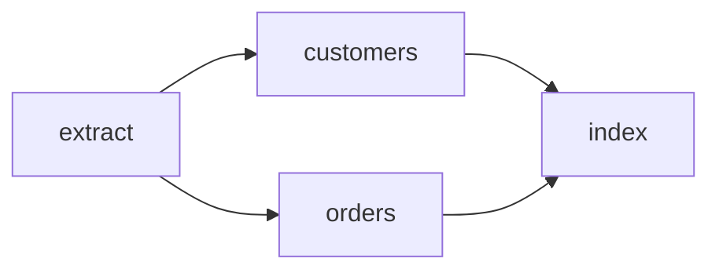

Workflows are an opt-in layer over ordinary jobs. The graph is validated before enqueue,
then prepared as one atomic batch containing a coordinator and pending children.

Graphs are deliberately bounded: 999 task nodes, 10,000 dependency edges, and 128 bytes
per task name. Coordinator ticks read and mutate nodes with a fixed concurrency of 16, so
a large valid graph cannot create an unbounded task or connection fan-out. Forged
coordinator payloads are revalidated by the worker before any graph operation runs.



## Prepare the graph

<CodeGroup>

```rust Rust
let batch = headgate_workflow::Workflow::new("daily-import")
    .coordinator_queue("workflows")
    .add("extract", extract, Vec::<String>::new())
    .add("customers", customers, ["extract"])
    .add("orders", orders, ["extract"])
    .add("index", index, ["customers", "orders"])
    .prepare()?;

store.enqueue(&batch).await?;
```

```go Go
batch, err := headgateworkflow.New("daily-import").
    CoordinatorQueue("workflows").
    Add("extract", extract).
    Add("customers", customers, "extract").
    Add("orders", orders, "extract").
    Add("index", index, "customers", "orders").
    Prepare()
if err == nil { err = store.Enqueue(ctx, batch) }
```

</CodeGroup>

## Run the coordinator

Register the coordinator on workers serving its queue, alongside every application task
handler. It uses bounded point reads through the inspection capability.

<CodeGroup>

```rust Rust
headgate_workflow::register_coordinator(
    &mut registry,
    store.clone(),
    Duration::from_secs(1),
)?;
```

```go Go
err := headgateworkflow.RegisterCoordinator(registry, store, time.Second)
```

</CodeGroup>

Roots are promoted first. A child becomes available only after every dependency completes.
If an upstream job reaches a failed terminal state, descendants that never ran are deleted
and the coordinator archives.

## Retention during long workflows

The builder raises every child retention value to at least the workflow retention. On each
tick, the coordinator copies newly observed completions into its fenced checkpoint before
it promotes dependent work. This makes completion evidence durable even when an early job
row expires while a later task is still running or retrying.

If operators must retain every child's full job detail, choose a workflow retention that
covers the expected maximum workflow runtime plus the desired inspection window. Dependency
correctness no longer depends on keeping every completed row for that entire time. A missing
node without recorded completion evidence remains a workflow failure.

## Long-running tasks and lease loss

The runner renews leases while a handler is executing. A suspended laptop, stopped
container, network partition, or overloaded process cannot renew, so the store eventually
reclaims the expired lease and counts a crash. That is expected recovery behavior: the old
attempt is fenced and a later attempt owns the job.

Make long stages resumable instead of relying on one uninterrupted process lifetime. Use a
named cursor step, persist the cursor after each safely repeatable unit, and stop promptly
when the handler context is cancelled.

<CodeGroup>

```rust Rust
let cursor_ctx = ctx.clone();
ctx.step_cursor("import-pages", move |cursor| {
    let ctx = cursor_ctx.clone();
    async move {
        let mut page = decode_page(cursor)?;
        while page < total_pages {
            import_page(page).await?;
            page += 1;
            ctx.set_cursor(serde_json::to_vec(&page)?).await?;
        }
        Ok(())
    }
}).await?;
```

```go Go
err := headgate.StepCursor(ctx, "import-pages", func(ctx context.Context, cursor PageCursor) error {
    for page := cursor.Page + 1; page <= totalPages; page++ {
        if err := importPage(ctx, page); err != nil { return err }
        if err := headgate.SetCursor(ctx, PageCursor{Page: page}); err != nil { return err }
    }
    return nil
})
```

</CodeGroup>

Cursor persistence is fence-verified. If the lease has already been reclaimed, the write
fails and the stale attempt must stop; the new attempt resumes from the last cursor that
the store accepted.

<Info>
This first workflow slice is immutable. Signals, timers, graph mutation, nested workflows,
and workflow-level retry are not claimed yet.
</Info>

<CardGroup cols={2}>
  <Card title="Run the workflow example" icon="play" href="/docs/examples/workflow" />
  <Card title="Inspect workflows in the UI" icon="panel-top" href="/docs/examples/ui-console" />
</CardGroup>
