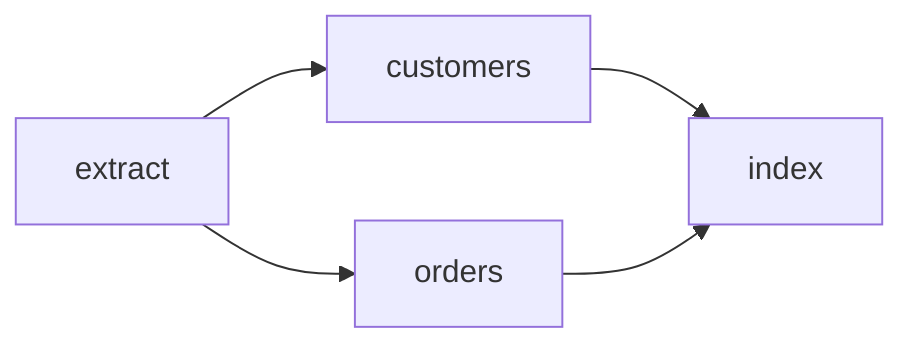

Workflows are an opt-in layer over ordinary jobs. The graph is validated before enqueue,
then prepared as one atomic batch containing a coordinator and pending children.



## Prepare the graph

<CodeGroup>

```rust Rust
let batch = headgate_workflow::Workflow::new("daily-import")
    .coordinator_queue("workflows")
    .add("extract", extract, Vec::<String>::new())
    .add("customers", customers, ["extract"])
    .add("orders", orders, ["extract"])
    .add("index", index, ["customers", "orders"])
    .prepare()?;

store.enqueue(&batch).await?;
```

```go Go
batch, err := workflow.New("daily-import").
    CoordinatorQueue("workflows").
    Add("extract", extract).
    Add("customers", customers, "extract").
    Add("orders", orders, "extract").
    Add("index", index, "customers", "orders").
    Prepare()
if err == nil { err = store.Enqueue(ctx, batch) }
```

</CodeGroup>

## Run the coordinator

Register the coordinator on workers serving its queue, alongside every application task
handler. It uses bounded point reads through the inspection capability.

<CodeGroup>

```rust Rust
headgate_workflow::register_coordinator(
    &mut registry,
    store.clone(),
    Duration::from_secs(1),
)?;
```

```go Go
err := workflow.RegisterCoordinator(registry, store, time.Second)
```

</CodeGroup>

Roots are promoted first. A child becomes available only after every dependency completes.
If an upstream job reaches a failed terminal state, descendants that never ran are deleted
and the coordinator archives.

<Info>
This first workflow slice is immutable. Signals, timers, graph mutation, nested workflows,
and workflow-level retry are not claimed yet.
</Info>

<CardGroup cols={2}>
  <Card title="Run the workflow example" icon="play" href="/docs/examples/workflow" />
  <Card title="Inspect workflows in the UI" icon="panel-top" href="/docs/examples/ui-console" />
</CardGroup>
