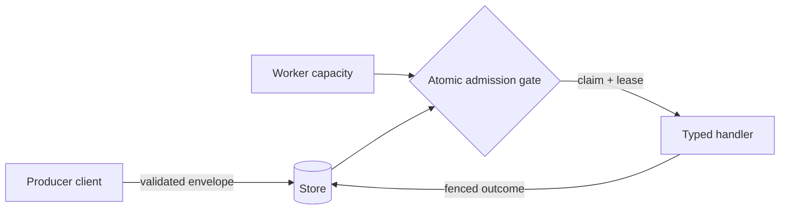

# The admission gate for background work

Most job queues ask the store for the next jobs. Headgate asks a different question:
**given fleet policy and available capacity, what may this worker run?** The store answers
atomically while it claims and leases the work.

<CardGroup cols={2}>
  <Card title="Start in five minutes" icon="rocket" href="/docs/quickstart">
    Define a typed task, enqueue it, and drain a worker using the in-memory store.
  </Card>
  <Card title="Understand the gate" icon="waypoints" href="/docs/concepts/admission">
    See how rate limits, fairness, concurrency, and quarantine become one admission decision.
  </Card>
  <Card title="Build a workflow" icon="git-fork" href="/docs/guides/workflows">
    Compose durable fan-out and fan-in dependencies in Rust or Go.
  </Card>
  <Card title="Explore the API" icon="braces" href="/docs/reference/control-api">
    Understand the control API, then use the interactive endpoint reference.
  </Card>
</CardGroup>

## Why headgate

<Columns cols={3}>
  <Card title="Fleet-wide policy" icon="globe-2">
    Rate limits and concurrency ceilings are shared across every worker process.
  </Card>
  <Card title="Two languages" icon="code-2">
    Rust and Go implement the same contracts from shared specifications and conformance tests.
  </Card>
  <Card title="Three stores" icon="database">
    PostgreSQL, MySQL, and Redis expose matching core behavior and honest optional capabilities.
  </Card>
</Columns>

## The execution path



<Note>
The worker never reimplements fleet policy. Moving policy evaluation out of the store would
make the result dependent on which worker happened to poll.
</Note>

## Pick your path

<CodeGroup>

```bash Rust
cargo run --manifest-path examples/rust/Cargo.toml --bin basic
```

```bash Go
cd examples/go
GOWORK=off go run ./basic
```

</CodeGroup>

<Card title="Continue to the quickstart" icon="arrow-right" href="/docs/quickstart">
  Build and verify your first job without installing a database.
</Card>
